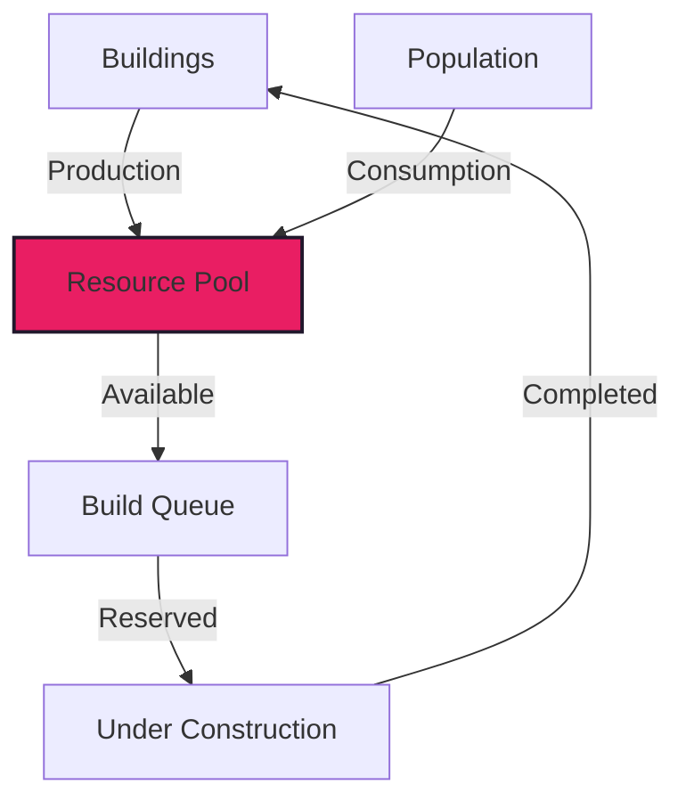
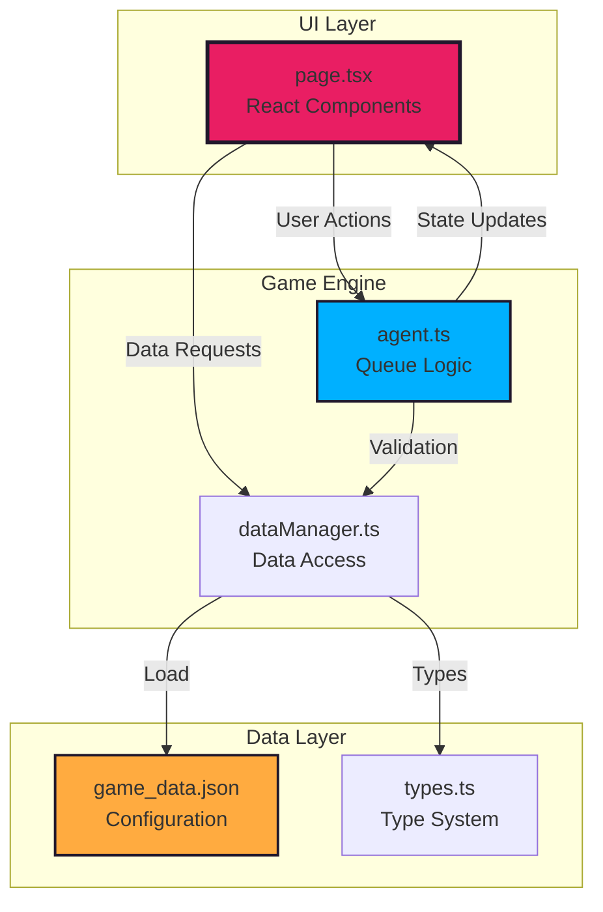

# 🌌 Florent Simulator

<div align="center">


[](https://github.com/yourusername/Florent)
[](https://nextjs.org/)
[](https://www.typescriptlang.org/)
[](https://reactjs.org/)
[](https://tailwindcss.com/)

**🎮 Interactive Build Order Simulator for Infinite Conflict**

*Plan your strategy • Optimize resources • Dominate the galaxy*

[**🚀 Live Demo**](http://localhost:3000) | [**📖 Documentation**](#documentation) | [**🤝 Contributing**](#contributing)

</div>

---

## ✨ What is Florent?

Florent Simulator is a **comprehensive strategic planning tool** designed for players of *Infinite Conflict*, enabling you to simulate and optimize your early-to-mid game build orders with precision. Think of it as your personal strategic command center where you can test different approaches, visualize resource flows, and perfect your timing before executing in the actual game.

<div align="center">


</div>

## 🎯 Key Features

<table>
<tr>
<td width="50%">

### 🏗️ **Dynamic Build Queue**
- Real-time prerequisite validation
- Automatic resource cost calculation
- Smart queue cancellation with refunds
- Visual progress tracking

</td>
<td width="50%">

### ⚡ **Time Simulation Engine**
- 200-turn timeline with slider control
- Auto-advance on item queueing
- Historical state viewing at any turn
- Energy stalling mechanics

</td>
</tr>
<tr>
<td width="50%">

### 📊 **Resource Management**
- Four resource types (Metal, Mineral, Food, Energy)
- Real-time income/consumption rates
- Abundance scaling for production
- Color-coded surplus/deficit indicators

</td>
<td width="50%">

### 🎨 **Intuitive Interface**
- Three-tab system (Structures, Ships, Colonists)
- Live filtering based on prerequisites
- Pink nebula sci-fi theme
- Responsive grid layout

</td>
</tr>
</table>

## 🚀 Quick Start

### Prerequisites

- **Node.js** 18.0+
- **npm** or **yarn**
- Modern browser (Chrome, Firefox, Safari, Edge)

### Installation

```bash
# Clone the repository
git clone https://github.com/yourusername/Florent.git
cd Florent

# Install dependencies
npm install

# Start development server
npm run dev

# Open http://localhost:3000 in your browser
```

### First Steps

1. **🎮 Launch the simulator** → Opens with starting resources and buildings
2. **🔍 Browse available items** → Switch between Structures, Ships, and Colonists tabs
3. **🖱️ Click to build** → Select any green (affordable) item
4. **⏰ Watch time advance** → Simulator auto-advances to completion
5. **📈 Track your progress** → Monitor resources and build queue
6. **🔄 Experiment freely** → Use Reset to try different strategies

## 🎮 Game Mechanics

### Starting Conditions

<div align="center">

| Resource | Starting Amount | Initial Production |
|----------|----------------|--------------------|
| 🔩 **Metal** | 30,000 | +400/turn (3 mines) |
| 💎 **Mineral** | 20,000 | 0/turn |
| 🌾 **Food** | 10,000 | -500/turn (population) |
| ⚡ **Energy** | 1,000 | +130/turn (outpost) |

| Starting Buildings | Effect |
|-------------------|--------|
| **Outpost** | +200 Workers/turn, +130 Energy/turn |
| **Metal Mine x3** | +400 Metal/turn each (with abundance) |

</div>

### Resource System



### Prerequisite Chain

Buildings unlock in a progression tree:

```
Outpost → Army Barracks → Fighter Factory → Advanced Ships
        ↘ Science Lab → Research Centers → Advanced Tech
         ↘ Trade Post → Economic Buildings → Late Game
```

## 🏗️ Architecture

### Technology Stack

<div align="center">

| Layer | Technology | Purpose |
|-------|------------|---------|
| **Frontend** | React 18 + Next.js 14 | UI Components & SSR |
| **State** | React Hooks | Game state management |
| **Styling** | Tailwind CSS | Pink nebula theme |
| **Language** | TypeScript 5.0 | Type safety |
| **Testing** | Vitest + RTL | Unit & integration tests |
| **Build** | Next.js Webpack | Production optimization |

</div>

### Project Structure

```
Florent/
├── 📁 src/
│   ├── 📁 app/                    # Next.js App Router
│   │   ├── 📄 page.tsx            # Main simulator UI
│   │   ├── 📄 layout.tsx          # Root layout & stars
│   │   └── 📄 globals.css         # Pink nebula theme
│   │
│   └── 📁 lib/game/               # Game Engine
│       ├── 📄 agent.ts            # Build queue logic
│       ├── 📄 dataManager.ts      # Data validation
│       ├── 📄 types.ts            # TypeScript types
│       └── 📄 game_data.json      # Game configuration
│
├── 📁 docs/                       # Documentation
│   ├── 📄 API.md                  # Function reference
│   └── 📄 PROJECT_INDEX.md        # Knowledge base
│
└── 📁 tests/                      # Test suites
    └── 📄 *.test.ts               # Unit/integration tests
```

### Core Systems

<div align="center">



</div>

## 📖 Documentation

### Core Documentation

- 📚 **[API Reference](./docs/API.md)** - Complete function and component documentation
- 🗂️ **[Project Index](./docs/PROJECT_INDEX.md)** - Cross-referenced knowledge base
- 🏛️ **[Architecture](./ARCHITECTURE.md)** - System design and patterns
- 🎮 **[Game Mechanics](./docs/MECHANICS.md)** - Detailed game rules
- 📋 **[ADR Tracker](./ARCHITECTURAL_DECISIONS.md)** - Architecture decisions log

### Development Guides

- 🤖 **[LLM Guidelines](./LLM_AND_DEV_GUIDELINES.md)** - AI-assisted development
- 🤝 **[Contributing](./CONTRIBUTING.md)** - How to contribute
- 🧪 **[Testing Guide](./docs/TESTING.md)** - Test strategies

## 🛠️ Development

### Available Commands

```bash
# Development
npm run dev          # Start dev server (port 3000)
npm run build        # Build for production
npm run start        # Start production server

# Quality
npm test            # Run test suite
npm run lint        # Check code style
npm run typecheck   # TypeScript validation
npm run test:coverage # Run tests with coverage thresholds (fails <70% lines / <60% branches)

# Analysis
npm run analyze     # Bundle size analysis
```

### Making Changes

#### Add New Structure
```javascript
// Edit src/lib/game/game_data.json
{
  "id": "plasma_generator",
  "name": "Plasma Generator",
  "build_time_turns": 10,
  "cost": [
    { "type": "resource", "id": "mineral", "amount": 5000 }
  ],
  "operations": {
    "production": [
      { "type": "energy", "base_amount": 500 }
    ]
  }
}
```

#### Modify Game Balance
```typescript
// Edit src/app/page.tsx - calculateIncome()
const foodConsumption = Math.floor(totalPop / 100) * 10; // Adjust ratio
```

## 🧪 Testing

### Running Tests & Coverage Gates

```bash
# Run all tests
npm test

# Enforce coverage thresholds (70% lines/statements/functions, 60% branches)
npm run test:coverage

# Run specific suite
npm test agent.test.ts

# Watch mode
npm test -- --watch
```

- Coverage reports are written to `coverage/`; the HTML report lives at `coverage/lcov-report/index.html`.
- Pull requests must pass `npm run test:coverage`; add or update tests before landing new logic.
- When coverage is intentionally reduced, include rationale in the PR description and update thresholds only via ADR.

## 🎮 Usage Examples

### Early Game Rush Strategy
```
Turn 0-10: Build 2x Metal Mines
Turn 10-20: Army Barracks → Queue Soldiers
Turn 20-30: Fighter Factory → Build Fighters
Turn 30+: Military expansion
```

### Economic Focus Build
```
Turn 0-15: Metal & Mineral infrastructure
Turn 15-25: Trade Posts for efficiency
Turn 25-35: Science Labs for research
Turn 35+: Advanced economy
```

## 🔮 Roadmap

### Version 0.2.0 (Planned)
- [ ] 🔬 Research system implementation
- [ ] 🌍 Multi-planet support
- [ ] ⚔️ Combat simulation
- [ ] 💾 Save/Load functionality

### Version 0.3.0 (Future)
- [ ] 📊 Advanced analytics dashboard
- [ ] 🤖 AI opponent strategies
- [ ] 🎯 Goal-based planning
- [ ] 📱 Mobile responsive design

## 🤝 Contributing

We welcome contributions! Please see our [Contributing Guide](./CONTRIBUTING.md) for details.

### Quick Contribution Steps

1. Fork the repository
2. Create a feature branch (`git checkout -b feature/amazing-feature`)
3. Make your changes
4. Run tests (`npm test`)
5. Commit with descriptive message
6. Push to your fork
7. Open a Pull Request

## 📝 License

This project is private and not licensed for public use.

## 🙏 Acknowledgments

- Game mechanics inspired by **Infinite Conflict**
- UI design influenced by sci-fi strategy games
- Built with the amazing **Next.js** and **React** ecosystems
- Pink nebula theme for that perfect space ambiance

---

<div align="center">

**Built with 💜 by the Florent Development Team**

[Report Bug](https://github.com/yourusername/Florent/issues) • [Request Feature](https://github.com/yourusername/Florent/issues) • [Documentation](./docs/)

*Current Version: 0.1.0 | Last Updated: December 2024*

</div>
