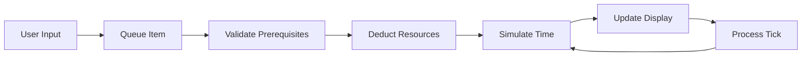

# 🎮 Florent Simulator

An interactive build order simulator and strategy planner for the game "Infinite Conflict". Plan your early-game strategy, optimize resource production, and visualize your build progression through an intuitive time-based interface.


## 📋 Table of Contents

- [Overview](#overview)
- [Features](#features)
- [Getting Started](#getting-started)
- [Usage Guide](#usage-guide)
- [Architecture](#architecture)
- [Development](#development)
- [Testing](#testing)
- [Documentation](#documentation)

## 🎯 Overview

Florent Simulator is a comprehensive build planning tool for Infinite Conflict players. It simulates the game's resource economy, building construction, and unit production systems, allowing players to:

- **Plan build orders** with real-time resource tracking
- **Visualize progression** through an interactive timeline
- **Optimize strategies** by testing different approaches
- **Understand prerequisites** and resource requirements

### Key Capabilities

- 🏗️ **Dynamic Build Queue**: Queue structures, ships, and colonists with automatic prerequisite checking
- ⏱️ **Time Simulation**: Advance through turns to see resource accumulation and building completion
- 📊 **Resource Management**: Track metal, mineral, food, and energy with income/consumption rates
- 🎯 **Smart Filtering**: Only shows buildable items based on current prerequisites
- 🔄 **Interactive Timeline**: Slider control to view any point in your build progression

## ✨ Features

### Core Functionality

#### 1. **Three-Tab Building System**
- **Structures**: Buildings that produce resources or unlock new units
- **Ships**: Military and support vessels for space operations
- **Colonists**: Population units (workers, soldiers, scientists)

#### 2. **Real-Time Resource Tracking**
```
Metal: 30,000 (+400/t)     [Green = positive income]
Mineral: 20,000 (+300/t)   [Red = negative income]
Food: 10,000 (-500/t)
Energy: 1,000 (+130/t)
```

#### 3. **Prerequisite System**
- Buildings unlock new structures and units
- Requirements checked in real-time
- Visual feedback for affordable vs unaffordable items

#### 4. **Time Control**
- Turn slider (0-200 turns)
- Auto-advance when queuing items
- View historical states at any turn

### Starting Conditions

```javascript
{
  resources: {
    metal: 30,000,
    mineral: 20,000,
    food: 10,000,
    energy: 1,000
  },
  buildings: [
    "Outpost",        // Produces 200 workers/turn
    "Metal Mine x3"   // Base metal production
  ],
  population: {
    workers: 50,000,
    soldiers: 0,
    scientists: 0
  }
}
```

## 🚀 Getting Started

### Prerequisites

- Node.js 18.0 or higher
- npm or yarn package manager

### Installation

```bash
# Clone the repository
git clone https://github.com/yourusername/Florent.git
cd Florent

# Install dependencies
npm install

# Start development server
npm run dev
```

The application will be available at `http://localhost:3000`

### Quick Start

1. **Open the simulator** in your browser
2. **Click any available item** in the "Available to Build" section
3. **Watch time advance** automatically to completion
4. **Use the turn slider** to explore different time points
5. **Click Reset** to start a new simulation

## 📖 Usage Guide

### Building Strategy

1. **Early Game (Turns 0-50)**
   - Focus on resource production buildings
   - Build Army Barracks to unlock soldiers
   - Establish mineral and food production

2. **Mid Game (Turns 50-100)**
   - Expand military capabilities
   - Build research facilities for scientists
   - Balance resource consumption with production

3. **Advanced Planning**
   - Use the timeline to identify resource bottlenecks
   - Test different build orders by resetting
   - Optimize for specific goals (military, research, economy)

### Interface Guide

```
┌─────────────────────────────────────────────────┐
│  Header: Title | Turn Counter | Resources       │
├─────────────────────────────────────────────────┤
│  Turn Slider: [0 ========|======== 200]         │
├──────────┬──────────────────────┬───────────────┤
│Completed │  Available to Build   │ Build Queue  │
│Buildings │  [Tabs: S | Sh | C]  │ Planet Info  │
│  List    │  [Buildable Items]    │ Population   │
└──────────┴──────────────────────┴───────────────┘
```

## 🏗️ Architecture

### Project Structure

```
Florent/
├── src/
│   ├── app/                 # Next.js app directory
│   │   ├── page.tsx         # Main simulator interface
│   │   ├── layout.tsx       # Root layout with metadata
│   │   └── globals.css      # Global styles
│   ├── lib/
│   │   └── game/            # Core game logic
│   │       ├── agent.ts     # Build queue and game mechanics
│   │       ├── dataManager.ts # Game data validation/access
│   │       ├── types.ts     # TypeScript type definitions
│   │       └── game_data.json # Game configuration data
│   └── components/          # Unused legacy components
├── docs/                    # Documentation
└── tests/                   # Test suites
```

### Core Systems

#### Game Agent (`agent.ts`)
- Manages build queue operations
- Validates prerequisites and costs
- Processes game ticks and resource updates

#### Data Manager (`dataManager.ts`)
- Provides typed access to game data
- Validates JSON configuration
- Manages units and structures catalog

#### Main Interface (`page.tsx`)
- React-based UI with hooks
- Time simulation engine
- State management for game progression

### Data Flow



## 🛠️ Development

### Available Scripts

```bash
npm run dev      # Start development server
npm run build    # Build for production
npm run start    # Start production server
npm run test     # Run test suite
npm run lint     # Run ESLint
```

### Technology Stack

- **Frontend**: Next.js 14, React 18, TypeScript
- **Styling**: Tailwind CSS with custom pink-nebula theme
- **Testing**: Vitest, React Testing Library
- **Build**: Webpack (via Next.js)

### Code Style

- TypeScript strict mode enabled
- ESLint with Next.js configuration
- Functional React components with hooks
- Immutable state updates

## 🧪 Testing

### Running Tests

```bash
# Run all tests
npm test

# Run with coverage
npm test -- --coverage

# Run specific test file
npm test agent.test.ts
```

### Test Coverage

- ✅ Game logic (agent.ts) - Unit tests
- ✅ Data validation (dataManager.ts) - Integration tests
- ✅ UI Components - Component tests
- ✅ Full simulation - E2E integration tests

## 📚 Documentation

### Additional Docs

- [Architecture Overview](./ARCHITECTURE.md) - System design and patterns
- [API Documentation](./docs/API.md) - Function and component APIs
- [Game Mechanics](./docs/MECHANICS.md) - Detailed game rules
- [Contributing Guide](./CONTRIBUTING.md) - Development guidelines

### Key Concepts

#### Resource System
- **Metal**: Primary construction material
- **Mineral**: Advanced building requirement
- **Food**: Population sustenance (consumed per 100 pop)
- **Energy**: Powers advanced structures

#### Prerequisites
- **Structure Requirements**: Buildings needed before construction
- **Research Flags**: Technology unlocks (future feature)
- **Resource Costs**: Materials consumed on queue

#### Time Mechanics
- **Ticks**: Base time unit (1 tick = 1 turn)
- **Build Time**: Turns required for completion
- **Stalling**: Energy deficit slows construction

## 🤝 Contributing

See [CONTRIBUTING.md](./CONTRIBUTING.md) for development guidelines.

## 📝 License

This project is private and not licensed for public use.

## 🙏 Acknowledgments

- Game mechanics based on Infinite Conflict
- UI design inspired by sci-fi strategy games
- Built with Next.js and React ecosystems

---

**Current Version**: 0.1.0 | **Last Updated**: December 2024

For questions or support, please open an issue in the GitHub repository.