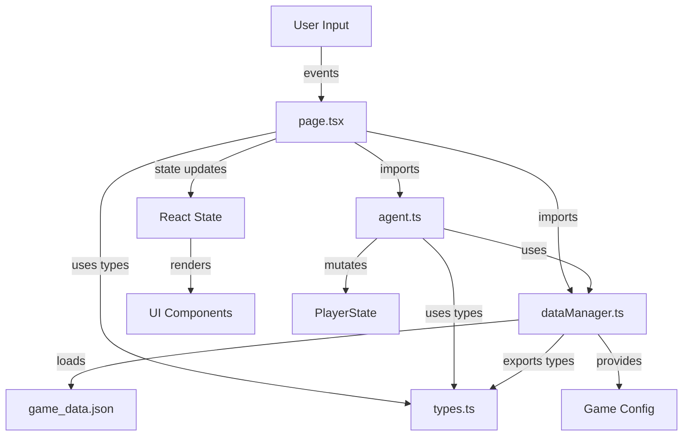

# Florent Simulator - Project Knowledge Base

## 📚 Complete Project Index

This document provides a comprehensive index of the Florent Simulator project with cross-references and navigation aids.

---

## 🗂️ Project Structure Map

```
Florent/
├── 📁 src/                          [Application Source]
│   ├── 📁 app/                      [Next.js App Router]
│   │   ├── 📄 page.tsx              → Main simulator interface
│   │   ├── 📄 layout.tsx            → Root layout & metadata
│   │   ├── 📄 globals.css           → Global styles & theme
│   │   ├── 📄 error.tsx             → Error boundary
│   │   ├── 📄 not-found.tsx        → 404 page
│   │   └── 📁 __tests__/
│   │       ├── 📄 page.test.tsx     → UI component tests
│   │       └── 📄 page-diagnostics.test.tsx
│   │
│   ├── 📁 lib/                      [Core Libraries]
│   │   └── 📁 game/                 [Game Engine]
│   │       ├── 📄 agent.ts          → Queue & mechanics
│   │       ├── 📄 dataManager.ts    → Data access layer
│   │       ├── 📄 types.ts          → TypeScript types
│   │       ├── 📄 catalog.ts        → Item catalog
│   │       ├── 📄 game_data.json    → Game configuration
│   │       └── 📁 __tests__/
│   │           ├── 📄 agent.test.ts → Unit tests
│   │           └── 📄 integration.test.ts
│   │
│   ├── 📁 components/               [Legacy Components]
│   │   ├── 📄 BuildList.tsx        → Unused
│   │   ├── 📄 QueueCard.tsx        → Unused
│   │   └── 📄 Header.tsx           → Unused
│   │
│   └── 📁 data/
│       └── 📄 colonistTypes.json    → Colonist definitions
│
├── 📁 docs/                         [Documentation]
│   ├── 📄 API.md                   → API Reference
│   ├── 📄 PROJECT_INDEX.md         → This file
│   └── 📄 MECHANICS.md             → Game mechanics
│
├── 📄 README_NEW.md                 → Project overview
├── 📄 ARCHITECTURE.md               → System design
├── 📄 ARCHITECTURAL_DECISIONS.md    → ADR tracker
├── 📄 LLM_AND_DEV_GUIDELINES.md    → AI guidelines
│
├── 📄 package.json                  → Dependencies
├── 📄 tsconfig.json                → TypeScript config
├── 📄 next.config.js               → Next.js config
├── 📄 tailwind.config.js           → Tailwind setup
├── 📄 vitest.config.ts             → Test configuration
└── 📄 postcss.config.js            → PostCSS config
```

---

## 🔗 Cross-Reference Index

### By Feature Area

#### **Resource Management**
- Definition: [`game_data.json`](../src/lib/game/game_data.json) → resources section
- Types: [`types.ts:3-9`](../src/lib/game/types.ts#L3) → ResourcePool
- Calculation: [`page.tsx:43-92`](../src/app/page.tsx#L43) → calculateIncome()
- Processing: [`agent.ts:224-281`](../src/lib/game/agent.ts#L224) → processTick()
- Display: [`page.tsx:263-270`](../src/app/page.tsx#L263) → Resource UI

#### **Build Queue System**
- Queue Logic: [`agent.ts:104-141`](../src/lib/game/agent.ts#L104) → enqueueItem()
- Cancel: [`agent.ts:173-186`](../src/lib/game/agent.ts#L173) → cancelQueueItem()
- UI Integration: [`page.tsx:195-222`](../src/app/page.tsx#L195) → queueItem()
- Display: [`page.tsx:397-417`](../src/app/page.tsx#L397) → Build Queue UI

#### **Prerequisites System**
- Validation: [`agent.ts:23-44`](../src/lib/game/agent.ts#L23) → validateRequirements()
- Structure Check: [`agent.ts:7-16`](../src/lib/game/agent.ts#L7) → hasStructure()
- UI Filter: [`page.tsx:143-192`](../src/app/page.tsx#L143) → availableItems
- Data: [`game_data.json`](../src/lib/game/game_data.json) → requirements field

#### **Time Simulation**
- Core Engine: [`agent.ts:224-281`](../src/lib/game/agent.ts#L224) → processTick()
- UI Simulation: [`page.tsx:95-104`](../src/app/page.tsx#L95) → simulateToTurn()
- Time Control: [`page.tsx:267-287`](../src/app/page.tsx#L267) → Turn Slider
- Auto-advance: [`page.tsx:208-221`](../src/app/page.tsx#L208) → Queue completion

#### **Data Management**
- Service: [`dataManager.ts:47-176`](../src/lib/game/dataManager.ts#L47) → GameDataService
- Validation: [`dataManager.ts:68-147`](../src/lib/game/dataManager.ts#L68) → Data validators
- Access: [`dataManager.ts:149-172`](../src/lib/game/dataManager.ts#L149) → Getters
- Config: [`game_data.json`](../src/lib/game/game_data.json) → All game data

---

## 📊 Component Relationships



---

## 🎮 Key Workflows

### 1. **Building an Item**
```
User clicks item → queueItem() → enqueueItem() → validateRequirements()
                                ↓
                   simulateToTurn() ← deductCost()
                                ↓
                        Update UI ← processTick() loop
```

### 2. **Resource Production**
```
processTick() → Loop buildings → Check operations.production
                              ↓
            Apply abundance scaling → Update resources
                              ↓
                    calculateIncome() → Display net income
```

### 3. **Prerequisite Checking**
```
Load all items → Filter by category → Check requirements[]
                                   ↓
                    hasStructure() → Check ownedBuildings
                                   ↓
                          Show/hide in Available list
```

---

## 🔍 Quick Navigation

### Core Files by Purpose

| Purpose | File | Key Functions |
|---------|------|---------------|
| **Main UI** | [`page.tsx`](../src/app/page.tsx) | Home(), queueItem(), resetSimulation() |
| **Game Logic** | [`agent.ts`](../src/lib/game/agent.ts) | enqueueItem(), processTick(), validateRequirements() |
| **Data Access** | [`dataManager.ts`](../src/lib/game/dataManager.ts) | getStructureById(), getUnitById() |
| **Type Definitions** | [`types.ts`](../src/lib/game/types.ts) | PlayerState, QueueItem, ResourcePool |
| **Configuration** | [`game_data.json`](../src/lib/game/game_data.json) | All game data |
| **Styles** | [`globals.css`](../src/app/globals.css) | Pink nebula theme |

### Test Coverage Map

| Component | Test File | Coverage Areas |
|-----------|-----------|----------------|
| page.tsx | [`page.test.tsx`](../src/app/__tests__/page.test.tsx) | UI rendering, sections |
| agent.ts | [`agent.test.ts`](../src/lib/game/__tests__/agent.test.ts) | Queue operations, validation |
| Full System | [`integration.test.ts`](../src/lib/game/__tests__/integration.test.ts) | Multi-tick simulation |

---

## 🛠️ Development Quick Reference

### Common Tasks

#### **Add New Structure**
1. Edit [`game_data.json`](../src/lib/game/game_data.json) → structures array
2. Add cost, requirements, operations
3. No code changes needed (data-driven)

#### **Add New Unit**
1. Edit [`game_data.json`](../src/lib/game/game_data.json) → units array
2. Set category: 'colonist' or 'ship'
3. Define cost and requirements

#### **Modify Starting Conditions**
1. Edit [`page.tsx:22-39`](../src/app/page.tsx#L22) → initializePlayer()
2. Adjust resources, buildings, population

#### **Change Resource Formula**
1. Edit [`page.tsx:43-92`](../src/app/page.tsx#L43) → calculateIncome()
2. Modify production/consumption logic

#### **Update UI Theme**
1. Edit [`tailwind.config.js`](../tailwind.config.js) → pink-nebula colors
2. Or modify [`globals.css`](../src/app/globals.css) → CSS variables

---

## 📝 Configuration Files

### Build & Development
- [`package.json`](../package.json) - Dependencies and scripts
- [`tsconfig.json`](../tsconfig.json) - TypeScript configuration
- [`next.config.js`](../next.config.js) - Next.js settings
- [`vitest.config.ts`](../vitest.config.ts) - Test runner config

### Styling
- [`tailwind.config.js`](../tailwind.config.js) - Tailwind customization
- [`postcss.config.js`](../postcss.config.js) - PostCSS plugins

### Documentation
- [`ARCHITECTURE.md`](../ARCHITECTURE.md) - System design
- [`ARCHITECTURAL_DECISIONS.md`](../ARCHITECTURAL_DECISIONS.md) - ADR log
- [`LLM_AND_DEV_GUIDELINES.md`](../LLM_AND_DEV_GUIDELINES.md) - AI guidelines

---

## 🚀 Entry Points

### User Interface
- **Main App**: [`src/app/page.tsx`](../src/app/page.tsx)
- **Start Here**: `npm run dev` → http://localhost:3000

### Testing
- **Run Tests**: `npm test`
- **Entry**: [`vitest.config.ts`](../vitest.config.ts)

### Data Configuration
- **Game Data**: [`src/lib/game/game_data.json`](../src/lib/game/game_data.json)
- **Types**: [`src/lib/game/types.ts`](../src/lib/game/types.ts)

---

## 📌 Important Notes

### Known Issues
1. Hydration warnings fixed with ClientOnly wrapper
2. Unused components in `/components` (legacy)
3. README.md has encoding issues (use README_NEW.md)

### Performance Considerations
- Deep cloning in simulateToTurn() - O(n) complexity
- Resource calculations scale with building count
- UI re-renders optimized with useMemo hooks

### Future Extensions
- Research system (structure exists in types)
- Multi-planet support (ground in meta)
- Combat simulation (ship units defined)
- Save/load functionality

---

**Last Updated**: December 2024
**Version**: 0.1.0
**Maintainer**: Development Team